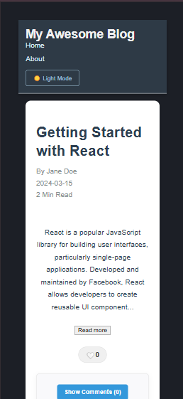

# react-blog:

# Assignment - 0 : Getting Started with React Development


In this section, I will guide you through the steps I followed to set up the project using Vite with the React template.

## 1. Initialize the Vite Project
- First, I navigated to my project folder where I had cloned the empty Git repository.
- To create a new Vite project with the React template, I ran the following command:
  ```bash
  npm create vite@latest my-blog -- --template react
  ```
  This command created a folder named `my-blog` with all the necessary files for a React project using Vite.
- Afterward, I changed into the newly created project folder:
  ```bash
  cd my-blog
  ```
- To install the required project dependencies, I ran:
  ```bash
  npm install
  ```

## 2. Verify the Development Server
- To verify that everything was set up correctly, I started the development server with the following command:
  ```bash
  npm run dev
  ```
- Finally, I opened my browser and navigated to [http://localhost:5173](http://localhost:5173). The default Vite welcome page appeared, confirming that the setup was successful and everything was working as expected.


## Project Description
This project is a simple blog platform that showcases the basics of a React application using Vite for a streamlined setup and development process. The blog includes a custom `Header` component with navigation links, responsive design, and smooth hover transitions for an enhanced user experience.

## Setup Instructions
To set up and run this project locally:

1. Clone the repository:
   ```bash
   git clone [YOUR_REPOSITORY_URL]
   ```
2. Navigate to the project folder:
  cd my-blog

3. Install the dependencies:
  npm install

4. Start the development server:
  npm run dev

5. Open http://localhost:5173/ in your browser to view the application.


## Project Structure:

my-blog/
├── .gitignore           # Files and directories ignored by Git
├── README.md            # Project description and setup instructions
├── package.json         # Project configuration and dependencies
├── vite.config.js       # Vite configuration for development
└── src/
    ├── components/      # Folder for reusable components
    │   ├── Header.jsx   # Header component for site navigation
    │   └── Header.css   # CSS styling for the Header component
    ├── App.jsx          # Main application component
    ├── main.jsx         # Entry point for React app rendering
    └── index.css        # Global styles for the application

## Screenshots 
Light theme : 
Dark theme : 

## What I Learned
From this assignment, I learned the following:

1. **Setting up a React project with Vite**: I gained hands-on experience in setting up a React project using Vite, which provides faster build times and better developer experience compared to older tools like Create React App.
   
2. **Creating Reusable Components**: I learned how to build reusable React components, such as the `Header`, and structure the project with a clear separation of concerns between components, styles, and global settings.
   
3. **CSS Styling for React Components**: I learned how to apply CSS to specific components in React, keeping the styling modular and scalable by organizing it into separate files (e.g., `Header.css` for the `Header` component).

4. **Implementing Dark Mode**: As part of the bonus challenge, I implemented a dark mode toggle feature in the header, allowing users to switch between light and dark themes for a better user experience.

5. **Responsive Design**: I enhanced the design of the `Header` component to be responsive, ensuring that it adapts well to various screen sizes, making the application user-friendly on both mobile and desktop devices.

6. **Adding Hover Effects and Transitions**: I implemented smooth hover effects and transitions on the navigation links and dark mode toggle, improving the visual appeal and interactivity of the user interface.


-----------------------------------------------------------------------------------------

# Assignment - 1: Blog Post Component Implementation

In this section, I will guide you through the steps I followed to implement the Blog Post component using React and CSS Modules.

## Components Structure

### BlogPost
- **Description**: The `BlogPost` component is used to display an individual blog post, including its title, content, author, date, and read time. It’s designed to be reusable and styled using CSS Modules.
- **Purpose**: This component allows the display of each post in a clean, organized manner with flexible content formatting options.

### BlogList
- **Description**: The `BlogList` component serves as a container for multiple `BlogPost` components. It is responsible for rendering a collection of posts dynamically by iterating over the posts data.
- **Purpose**: This component is used to display a list of all the blog posts on the main page of the blog.

### Header
- **Description**: The `Header` component is used to display the site title, navigation links, and additional information like the dark mode toggle.
- **Purpose**: It provides the navigation structure and helps in controlling the app’s theme.

## Styling Approach

For this project, I chose to use **CSS Modules** for styling. This approach allows for scoped styles, meaning that the CSS classes are specific to the component and do not leak into others. This makes the codebase easier to maintain and avoids conflicts between styles.

### Why CSS Modules?
- **Component-based Styles**: Since each component is isolated with its own CSS, styling becomes more modular and maintainable.
- **No Global Styles Collision**: Unlike traditional global CSS, CSS Modules ensure that each class name is locally scoped, preventing conflicts in large applications.
- **Easier Refactoring**: The modular nature of CSS Modules helps in easily refactoring or adding new components without worrying about unintended style changes elsewhere.

## New Features

Here are the features I’ve added in this assignment:

1. **BlogPost Component**: 
   - Displays individual blog posts with title, content, author, date, and read time.
   - Styling for the blog post is modularized using CSS Modules.
   - Added hover effects for interactive experience.

2. **BlogList Component**: 
   - A container that renders multiple `BlogPost` components dynamically.
   - Iterates over a list of posts and passes the necessary props to `BlogPost`.

3. **Responsive Design**: 
   - Ensured that the layout is mobile-responsive by using media queries.
   - Adjusted font sizes, spacing, and layout for smaller screens.

4. **Interactive Hover Effects**: 
   - Added hover effects to make the blog posts interactive, improving user experience.

5. **Content Formatting**: 
   - Incorporated blockquotes, links, and images with proper styling to improve content readability.

## Screenshots

### Desktop View:
Light Theme : 

### Mobile View:
Dark Theme : 


-----------------------------------------------------------------------------------------

# Assignment - 2: Interactive Blog Post Enhancements

In this assignment, I made my blog more interactive by adding like buttons, a comment section, and read time estimation using React and CSS Modules.

## Components Structure

### BlogPost

- **Description**: Displays each blog post with title, author, date, read time, likes, and comments. Uses hooks to handle likes, comments, and content expansion.

- **Purpose**: Engages users with interactive content display and feedback options.

### LikeButton

- **Description**: Tracks and displays like counts, toggling a heart icon for user feedback.
- **Purpose**: Allows users to like posts, enhancing engagement.

### CommentSection

- **Description**: Allows users to add comments and shows a comment count. Toggle button for showing/hiding comments.
- **Purpose**: Encourages user interaction by sharing thoughts on each post.


## New Features

Here are the features I’ve added in this assignment:


1. **Like Button**: 
  - Like or unlike posts with real-time updates.

2. **Comment Section**: 
  - Add and toggle comments to foster engagement.

3. **Read More / Less Toggle**: 
 - Expands and collapses content.

4. **Read Time Estimation**: 
  - Displays estimated read time for each post.

## Styling & Responsive Design

- **CSS Modules**: Scoped styles for each component to avoid conflicts.

- **Responsive Design**: Adjusted layout for mobile, with interactive elements and media queries.

## Screenshots

Desktop View : 

Mobile View : 


--------------------------------------------------------------------------------------


# Assignment 3: Building a Blog Post Editor

In this assignment, I created a dynamic and functional blog post editor using React. This editor includes features such as form handling, validation, a rich text editor, and a tag input system.

## Components Structure

### PostEditor

- **Description**: The main form for editing blog posts, including title, content, category, and publishing status. Handles form state and validation.

- **Purpose**: Allows users to create and edit posts with real-time validation, ensuring a smooth experience.

### TagInput

- **Description**: A custom input field for adding tags to a post. Supports adding, removing, and displaying tags.

- **Purpose**: Enables users to tag their posts for categorization and better discoverability.

### RichTextEditor

- **Description**: A text area for editing the content of the post with rich text formatting options, such as bold, italic, and headings.

- **Purpose**: Provides a rich editing experience with basic formatting features.

## New Features

Here are the features I’ve added in this assignment:

- **Post Editor Form**:

Collects title, content, category, and publish status for each post.
Real-time form validation for title and content.

- **Tag Input**:

Allows users to input multiple tags by pressing the Enter key.
Tags can be removed individually, and error messages are shown when validation fails.

- **Rich Text Editor**:

Implements basic text formatting options like bold, italic, and headings.
Updates post content based on selected formatting.

- **Form Validation**:

Immediate validation for each field (title, content, tags).
Validation feedback is shown as users interact with the form.
Error messages appear when the user tries to submit incomplete or invalid forms.

- **Publish or Save Draft**:

A checkbox to toggle between saving the post as a draft or publishing it immediately.


## Styling & Responsive Design

- **CSS Modules**: Scoped styles for each component to avoid global style conflicts.

- **Responsive Design**: The form adjusts for mobile and tablet views to ensure usability across devices.


----------------------------------------------------------------------------------------

